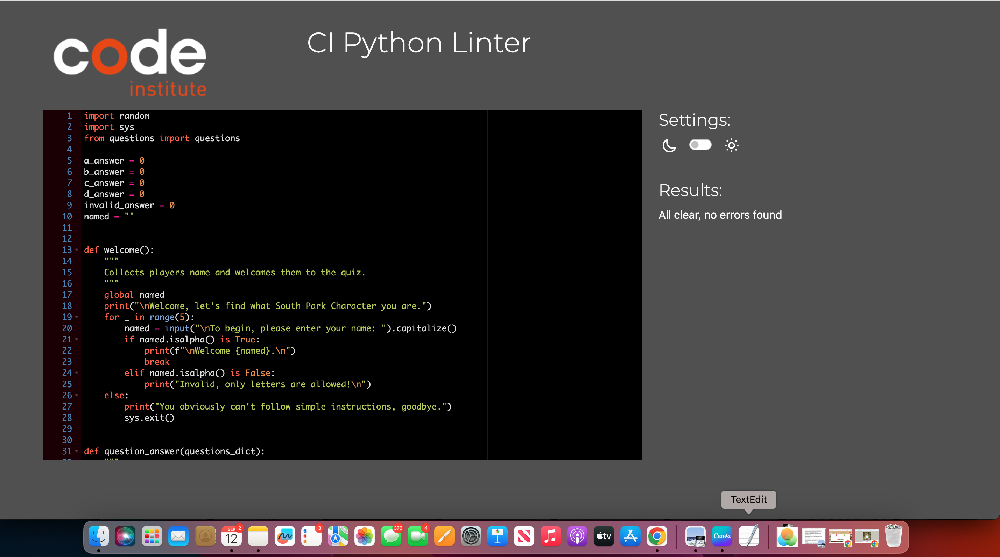

# Which Tv Character Are You?

The purpoose of the website is to allow the users to find out which tv charcter they are. The site currently only allows for them to answer questions which can tell them which main South Park character they are. 

The game is targeted for theose who are fans of South Park, which can range from 21+. The users would like this as the questions do not tend to repeat themself, so each game they will randomly get a question, whiich could lead them to getting a new character each time. This is good for palying on your break or just passing the time.

## Features To Implement

* In the future a feature I would like to implement is the users can choose which game they would like to play, for instace they could choose to find out which Simpson character they are.
* Another feature I would like to implement would be the results don't just give them one of the main characters, but also any side characters in the show.

## Testing

* The code has three inputs:

- The first input is for the name, in the welcome function. If the user enters symbols or numbers, anything that is not letters, they will be told it is invalid. It has been checked that if they can not do so after five attempts the game ends.
- Another test from the name input would be if after failing to put in a valid name, but putting a successful input it progresses, which it does.

- The second input is to chcek the user has put in the correct letter for the questions. The input has been checked to make sure it can only accept; a, b, c, d, in lowercase or capital. 
- It has also been checked to make sure that if the user does input a invalid letter, symbol or number they are given a chance to put in one of the correct letters. It has been checked that if they can not do so after five attempts the game ends.
- It has also been checked that if they have put a invalid input, then put a valid input the game continues. 

- The third input is for repeat quiz to start the game over. The input has been checked to make sure it only accepts yes or no, if a yes or y is given the game restarts. It has been checked that if a no or n is put the game ends. 
- It has been checked that if the user puts anyhing other than yes or no, y/n, the question is repeated, until thhey choose. one of the two.

* The code had tested to make sure that it generates 5 random questions, without repeating the same questions in one game.

### Validator Testing

* To validate the code breakpoint() had been used for the whole code.
* Another way to test the code was it had been put through the Code Institute PEP8 linter validator.

* Throughout the process of creating the code the problems tab in Codeanywhere had been checked to make sure not problems were detected.

### Unfixed Bugs

* To the best of my knowledge, no bugs have been left unfixed.

## Deployment

The sites initial deployment steps:
* The Github repository was created from the Code Institute repository template. 
* Then a workspace had been opened in Codeanywhere.
* Once completed and opened the intial commit was added, committed and pushed to the Github repository.
* Throughout the process of creating the code, git add/commit/push was used.

The site was deployed to Heroku. The steps to deploying to Heroku are:
* Installed dependencies in requirements.txt.
* In Heroku home page click create new app.
* Then a unique name was created for the project.
* Then a build pack for Python was created, which was Python and Node.js.
* In the deployment section, a Deployment method was selected which was GitHub.
* The Github Repository was the connected, searching for the reposirtory name used on Github.
* Next enable Manual Deploy and Automatic Deploy.

The Deployed web application link can be found here: [Deployed Website](https://which-tv-character-are-you-86f095b68cfc.herokuapp.com/)

